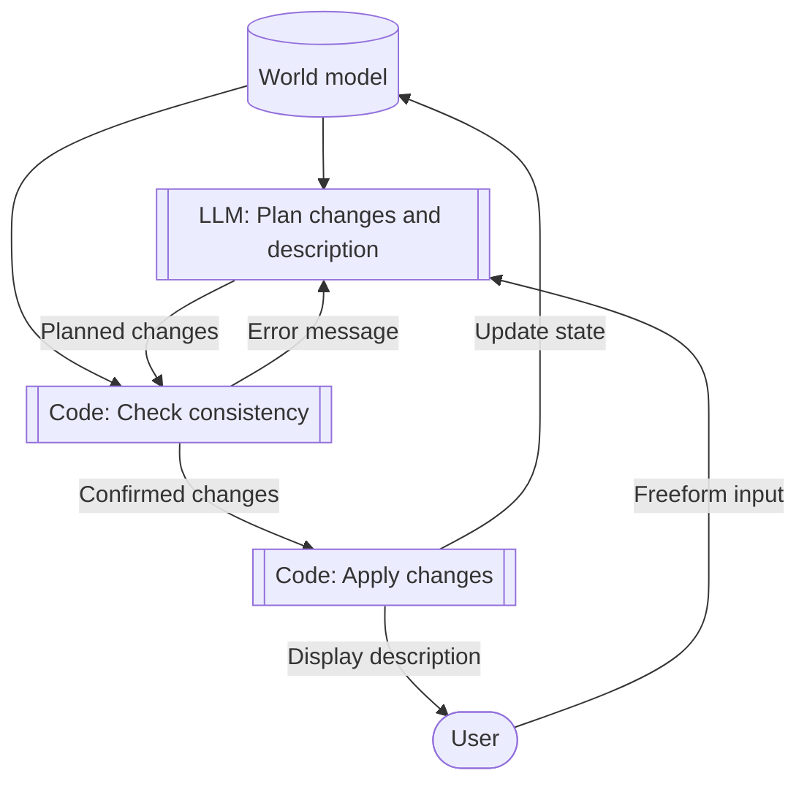

# Dungeon
An LLM-powered text adventure game that attempts to have a coherent world model.

## Status
Very early. Core game loop isn't implemented yet.

## Quickstart
- Have Ollama installed and set up.
- `ollama serve`
- `. ./build.sh && go build -o bin/main main.go && bin/main`

## Proposed Structure (not current implementation)

## Plan
- Actually update `<world></world>` state.
- Action encoder is doing odd things with notes.
    - Maybe remove those and include past descriptions in context?
- Error message to adjudicate LLM step.
    - Both syntax and "not allowed" errors.
    - Keep looping until adjudicator plus action-encode give something valid.
    - Limit loop count presumably.
- Some kind of player health/condition tracking?
    - Something more interesting that can take advantage of LLM fuzzy reasoning - Joie de vivre?
- Sanitise player input, remove `<world>` tags if given.
- Normally block narrator from giving clues, but from code side add them in if they appear stuck?
- Anything to optimise LLM steps.
