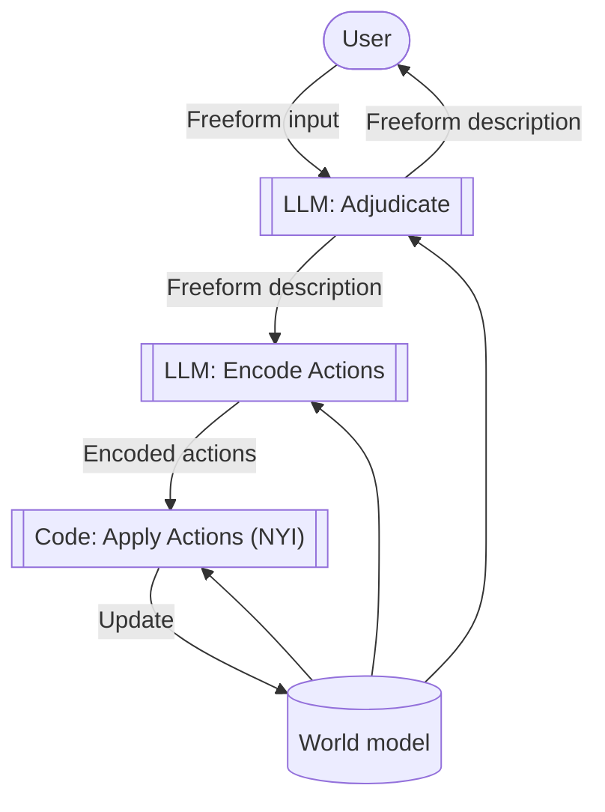

# Dungeon
An LLM-powered text adventure game that attempts to have a coherent world model.

## Status
Very early. Core game loop isn't implemented yet.

## Quickstart
- Have Ollama installed and set up.
- `ollama serve`
- `. ./build.sh && go build -o bin/main main.go && bin/main`

## Process structure

## Plan
- Do not rely on LLM to update JSON manually. Instead have it provide a diff.
- Convince the adjudicator to stop inventing objects.
- Some kind of player health/condition tracking?
    - Something more interesting that can take advantage of LLM reasoning.
- Anything to optimise LLM steps.
