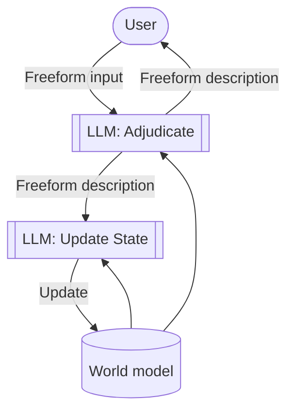

# Dungeon
An LLM-powered text adventure game that attempts to have a coherent world model.

## Status
Imperfect proof of concept.

## Quickstart
- Have Ollama installed and set up.
- `ollama serve`
- `. ./build.sh && go build -o bin/main main.go && bin/main`

## Process structure

## Plan
- Do not rely on LLM to update JSON directly.
    - Instead describe changes it wants to make and apply those.
- Adjudicator to stop inventing objects.
- Adjudicator to be less "helpful" so it doesn't just solve problems.
- Generation of scenes.
    - Goal.
    - Obstacles.
    - Means of overcoming obstacles.
- Some kind of player health/condition tracking?
    - Something more interesting that can take advantage of LLM reasoning.
- Anything to optimise LLM steps.
